# Lab3
# Hasil Tugas-Tugas Pertemuan 7
# StrukturKondisi
## Program Bilangan Terbesar Antara 2
### Program ini adalah penentu bilangan besar antara dua angka yang di input        
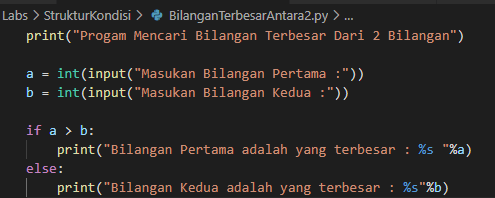
### Begini Hasil Outputnya                                                                                             
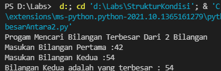
## Program Mengurutkan Angka
### Program Ini adalah penentu urutan angka yang di input           
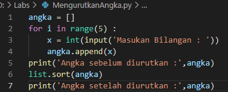
### Begini Hasil Outputnya                                                                                    
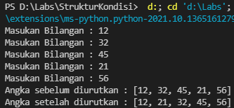

# Perulangan

## Berikut Contoh program Nested Loop
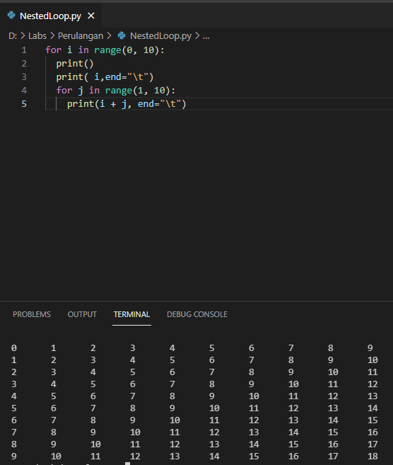
## Berikut Contoh Program Menghitung nilai acak di bawa 0.5
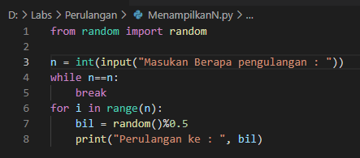
## Berikut Hasil nya
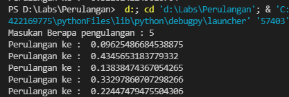

# labspy02
## Program Menentukan Bilangan Terbesar di Antara 3 Bilangan

### Berikut Contoh Bentuk Flowchart
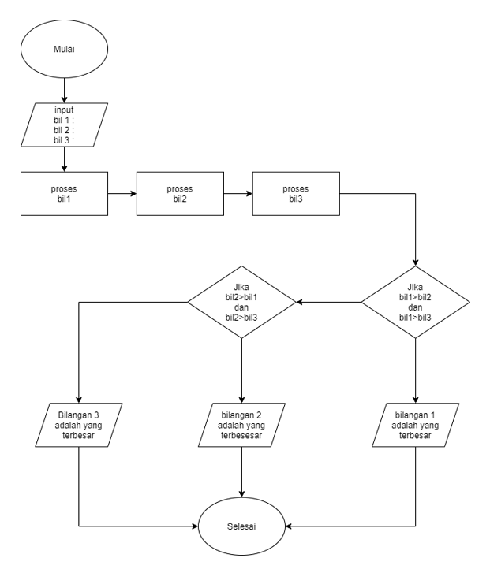
#### Dengan Memasukan 3 Angka Program akan membandingkan di antara 3 bilangan tersebut lalu memberikan hasil di antara ke 3 bilangan
### Berikut Contoh Code Program
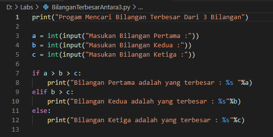
### Berikut Contoh Ketika Angka Pertama yang Terbesar
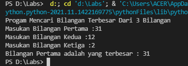
### Berikut Contoh Ketika Angka Kedua yang Terbesar
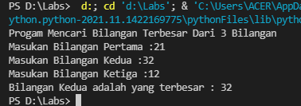
### Berikut Contoh Ketika Angka Ketiga yang Terbesar
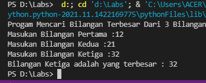

# labspy03
## Tugas Praktikum 3

## Latihan1.py
### Menampilkan n Bilangan Acak yang Lebih Kecil Dari 0.5
#### Dengan cara menginput N akan muncul beberapa nilai acak dari angka di bawah 0.5
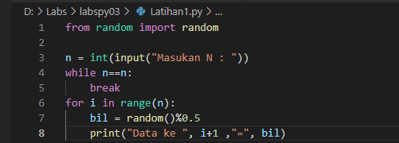
### Berikut Outputnya
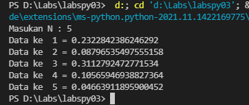

## Latihan2.py
### Menentukan Bilangan Terbesar dari beberapa bilangan dan program berhenti jika menginput 0
#### Dengan menginput beberapa angka lalu program akan berhenti jika menginput angka 0 dan memberikan hasil angka yang terbesar
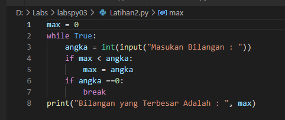
### Berikut Outputnya
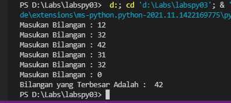

## Program1.py
### Menentukan Laba Investasi dengan skenario yang sudah di tentukan
#### Dengan Menginput Modal Awal senilai 100.000.000 program akan menghitung berapa laba perbulan sesuai skenario dan total nya
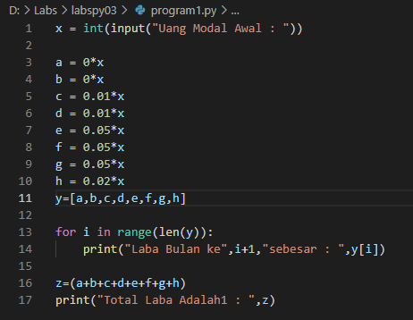
### Berikut Outputnya
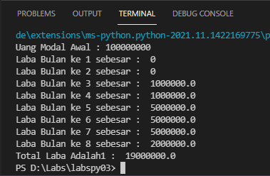

